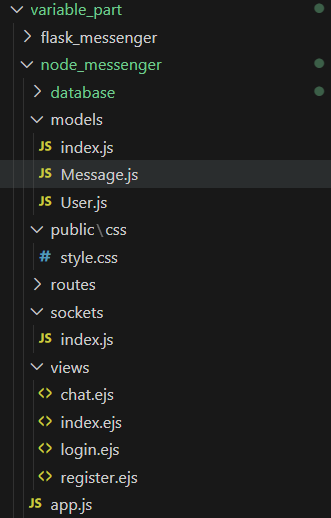
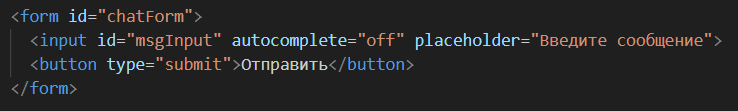
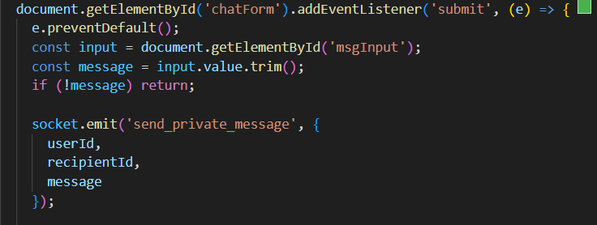
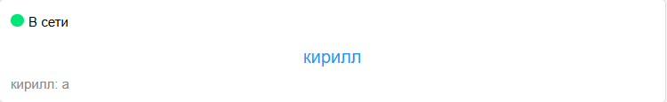
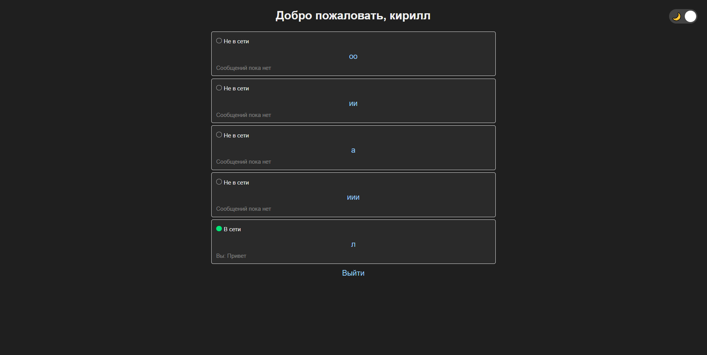

# 📖 Веб-мессенджер на Node.js, Socket.IO и SQLite

## 📌 О проекте

Этот проект представляет собой веб-мессенджер с поддержкой:

* Регистрации и авторизации пользователей
* Приватных чатов между пользователями
* Онлайн-статусов
* Последних сообщений в списке пользователей
* Светлой и тёмной темы
* Работающего обмена сообщениями в реальном времени через Socket.IO

---
Перед разработкой был проведён анализ:

📚 Изучение аналогов

Популярные мессенджеры: Telegram, WhatsApp.

Какие функции должны быть в базовом чате.

📌 Определение ключевых требований

Поддержка приватных чатов.

Онлайн-статус пользователей.

Отправка и получение сообщений в реальном времени.

Светлая/тёмная темы.

📝 Выбор технологий

Node.js + Express — сервер.

Sequelize + SQLite — простая и быстрая БД.

Socket.IO — обмен сообщениями без перезагрузки.

EJS — шаблонизация.

CSS — кастомизация интерфейса.

🎨 Проектирование интерфейса

Макеты страниц регистрации, входа, чата.

Отображение онлайн-статусов.

Переключатель темы.

📊 Планирование архитектуры

Структура папок и файлов.

Диаграмма взаимодействия компонентов.

---
## 📂 Структура проекта

```
/project-root/
├── app.js                   // основной сервер
├── /routes/                 // маршруты
├── /models/                 // модели БД
├── /sockets/                // обработчики сокетов
├── /views/                  // шаблоны EJS
├── /public/                 // статические ресурсы
├── database.sqlite          // база SQLite
├── package.json             // зависимости
└── README.md                // документация
```

---

## 📦 Установка и запуск

1. Установить зависимости:

```bash
npm install express sqlite3 sequelize bcrypt express-session socket.io ejs
```

2. Запустить сервер:

```bash
node app.js
```

3. Открыть в браузере:

```
http://localhost:3000
```

---

## 📑 Основные файлы

* **app.js** — основной сервер, настройка Express и Socket.IO
* **/routes/index.js** — маршруты регистрации, входа, чатов
* **/models/User.js** и **/models/Message.js** — модели БД
* **/sockets/** — работа с Socket.IO: подключение, статусы, сообщения
* **/views/** — шаблоны страниц (chat.ejs, index.ejs, login.ejs, register.ejs)
* **/public/css/style.css** — оформление интерфейса и тем

---

## 📡 Технологии

* **Node.js**
* **Express**
* **Sequelize** + **SQLite**
* **Socket.IO**
* **EJS**
* **CSS**

---

## 📸 Иллюстрации

### 📌 Структура проекта



### 📌 Веб-чат в действии


### 📌 Онлайн-статусы



### 📌 Темная и светлая тема



---

## 🔍 Последовательность действий по исследованию предметной области и созданию технологии

1. 📚 **Изучение аналогов**
2. 📌 **Определение ключевых требований**
3. 📝 **Выбор технологий**
4. 🎨 **Проектирование интерфейса**
5. 📊 **Планирование архитектуры**

---

## 🛠️ Техническое руководство по созданию технологии (для начинающих)

### 📦 Установка окружения

```bash
npm init -y
npm install express sqlite3 sequelize bcrypt express-session socket.io ejs
```

### 📁 Создание структуры проекта

```bash
mkdir routes models sockets views public public/css
touch app.js
touch database.sqlite
```

### 📚 Описание моделей Sequelize

**/models/User.js**

```javascript
module.exports = (sequelize, DataTypes) => {
  return sequelize.define('User', {
    username: { type: DataTypes.STRING, unique: true, allowNull: false },
    password: { type: DataTypes.STRING, allowNull: false }
  });
};
```

**/models/Message.js**

```javascript
module.exports = (sequelize, DataTypes) => {
  return sequelize.define('Message', {
    content: { type: DataTypes.TEXT, allowNull: false },
    sender_id: DataTypes.INTEGER,
    recipient_id: DataTypes.INTEGER
  });
};
```

### 📡 Настройка Socket.IO в app.js

```javascript
const http = require('http');
const { Server } = require('socket.io');

const server = http.createServer(app);
const io = new Server(server);

io.on('connection', socket => {
  socket.on('message', data => {
    io.emit('message', data);
  });
});
```

### 📃 Основные маршруты (routes/index.js)

* Регистрация
* Авторизация
* Чат-лист пользователей
* Личный чат

### 📄 Создание шаблонов EJS

**/views/chat.ejs**

```ejs
<ul id="messages"></ul>
<form id="chatForm">
  <input id="msgInput" />
  <button>Отправить</button>
</form>
```

### 🎨 CSS оформление

**public/css/style.css**

```css
body {
  background: var(--bg-color);
  color: var(--text-color);
}
