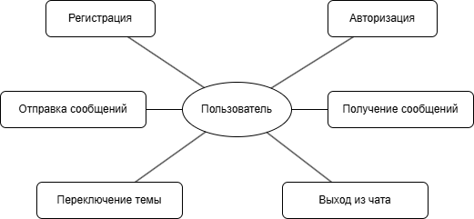
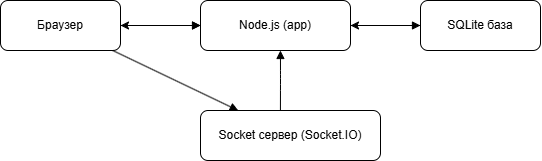
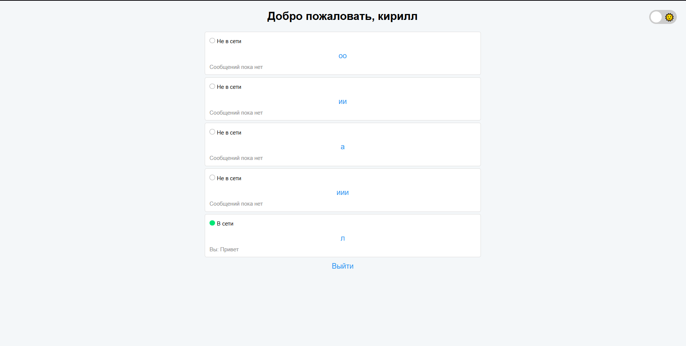
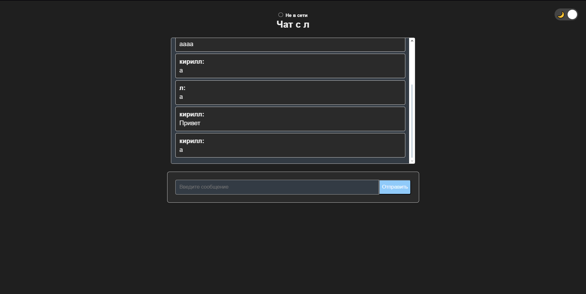

# 📖 Техническое руководство по созданию веб-мессенджера на Node.js, Socket.IO и SQLite

---

## 📌 Описание проекта

Этот проект — учебный веб-мессенджер на Node.js с приватными чатами между пользователями. Поддерживает регистрацию, авторизацию, онлайн-статусы, последние сообщения, светлую/тёмную тему, работу в реальном времени через Socket.IO.

---

## 📑 Этапы проектирования

### 📊 Анализ предметной области

* Пользователь может зарегистрироваться и авторизоваться.
* Каждый пользователь может общаться только в приватных чатах.
* В списке отображается статус (в сети/не в сети) и последнее сообщение.
* Тема интерфейса переключается между светлой и тёмной.

### 📈 Диаграмма вариантов использования




---

## 📂 Структура проекта

| Директория        | Назначение                         |
| :---------------- | :--------------------------------- |
| `/models`         | Sequelize-модели User и Message    |
| `/routes`         | Маршруты регистрации, входа, чатов |
| `/sockets`        | Socket.IO обработчики              |
| `/views`          | EJS-шаблоны страниц                |
| `/public`         | CSS, JS, изображения               |
| `app.js`          | Основной сервер и инициализация    |
| `database.sqlite` | База данных SQLite                 |

---

## 📡 Архитектура системы

### 📌 Диаграмма компонентов



---

## 📦 Установка и запуск проекта

```bash
npm install express sqlite3 sequelize bcrypt express-session socket.io ejs
node app.js
```

Открыть браузер по адресу:

```
http://localhost:3000
```

---

## 📜 Маршруты приложения

| Метод | Путь        | Описание                 |
| :---- | :---------- | :----------------------- |
| GET   | `/`         | Список пользователей     |
| GET   | `/chat/:id` | Приватный чат            |
| GET   | `/login`    | Страница авторизации     |
| POST  | `/login`    | Обработка входа          |
| GET   | `/register` | Форма регистрации        |
| POST  | `/register` | Регистрация пользователя |
| GET   | `/logout`   | Завершение сессии        |

---

## 📊 Диаграмма последовательности (Sequence UML)

```
Пользователь -> Браузер : вводит сообщение
Браузер -> Socket.IO : отправляет событие send_private_message
Socket.IO -> Сервер : сохраняет сообщение в БД
Сервер -> Socket.IO : отправляет receive_private_message
Socket.IO -> Браузер : выводит сообщение в чате
```

---

## 📘 Ключевые технологии

| Технология    | Назначение                       |
| :------------ | :------------------------------- |
| **Node.js**   | Серверная платформа              |
| **Express**   | Работа с HTTP-запросами          |
| **Sequelize** | ORM для работы с SQLite          |
| **Socket.IO** | Двусторонняя связь клиент-сервер |
| **EJS**       | Шаблонизатор HTML-страниц        |
| **CSS**       | Оформление интерфейса            |

---

## 📸 Интерфейс приложения

* 📱 Светлая и тёмная тема
* ✅ Онлайн/офлайн статус
* 📩 Последние сообщения в списке
* 📡 Сообщения в реальном времени без перезагрузки



